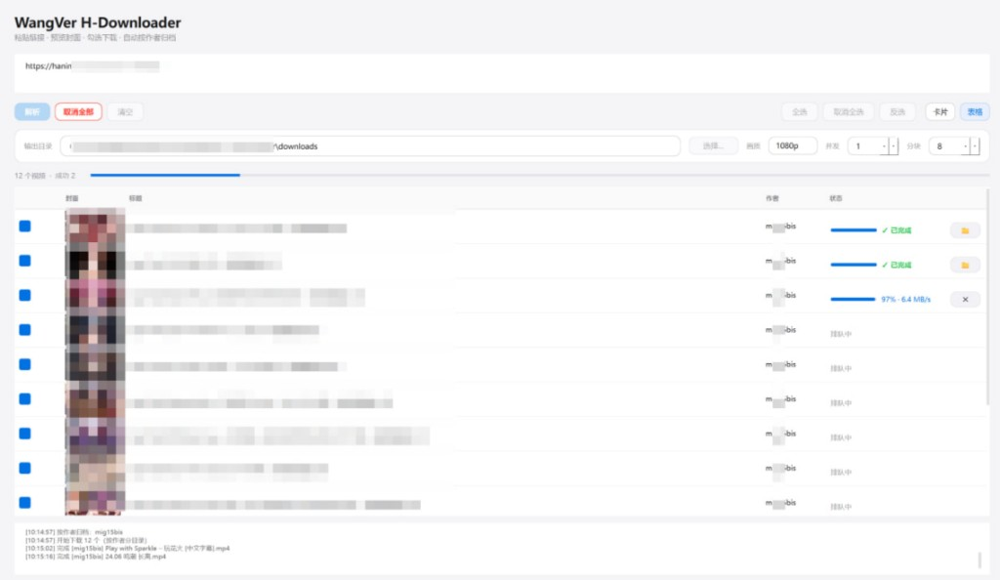

<div align="center">

# Ver-Hanime1Downloader

**专为 hanime1.me 打造的高性能桌面下载器**

浏览器辅助过 Cloudflare · 多线程分块下载 · 封面预览与勾选下载 · 自动按作者归档

[](https://www.python.org/)
[](https://doc.qt.io/qtforpython-6/)
[](https://playwright.dev/python/)
[](LICENSE)
[]()

<br>



</div>

---

## ✨ 核心特性

| 特性 | 说明 |
|------|------|
| 🎨 **Apple 风浅色 GUI** | 圆润极简的桌面界面，卡片 + 表格双视图自由切换 |
| 🧠 **先解析后下载** | 解析完成后展示封面 / 标题 / 作者，勾选确认再开始下载 |
| 🛡️ **CF 半自动绕过** | 浏览器默认隐藏运行；触发 Cloudflare 验证时自动弹窗，验证通过后再次隐藏 |
| 📋 **剪贴板感应** | 复制视频链接 → 软件自动提示，点解析即可填入 |
| 🎯 **同列表精准抓取** | 严格限定 `#video-playlist-wrapper` 范围，不混入推荐列表 |
| ⚡ **多任务 + 分块并发** | 共享 `httpx.AsyncClient` 连接池 + 自动重试，速率与稳定性兼顾 |
| 📂 **自动按作者归档** | 多视频下载时自动建 `输出目录/作者/视频.mp4` |
| 🔄 **断点续传** | `.part` 临时文件，中断后继续下载从断点接力 |
| 🚦 **细粒度控制** | 单任务取消 / 全部取消，完成后一键打开所在文件夹 |
| 🧹 **文件名清洗** | 自动剥离站点水印（`H動漫裏番線上看`、`Hanime1.me` 等），便于媒体库刮削 |

---

## 🚀 快速开始

### 方式一：下载预编译版本（推荐）

1. 前往 [Releases](../../releases) 下载最新的 `Ver-Hanime1Downloader-vX.X.X-windows.zip`
2. 解压到任意目录
3. 双击 `Ver-Hanime1Downloader.exe` 即可启动

> **首次启动需要**：本机已安装 [Google Chrome](https://www.google.com/chrome/)（Playwright 会自动调用系统 Chrome）。

### 方式二：从源码运行

```bash
git clone https://github.com/wangver721/Ver-Hanime1Downloader.git
cd Ver-Hanime1Downloader

pip install -r requirements.txt
python -m playwright install chromium

python run.py
```

---

## 🖥️ 使用流程

```
1. 粘贴链接          →  支持单链接 / 多链接（每行一个）/ .txt 路径 / 拖拽
2. 点击「解析」       →  浏览器后台运行；遇 CF 自动弹窗供你验证
3. 选择解析模式       →  仅解析当前视频  /  展开整个播放列表
4. 浏览预览卡片       →  封面 + 标题 + 作者，勾选要下载的项
5. 点击「下载勾选项」  →  实时进度、速度、剩余时间；可单独/全部取消
6. 完成后打开文件夹   →  卡片 / 表格行的 📁 按钮一键定位文件
```

### 双视图

- **卡片视图**：封面网格（1～3 列自适应），适合浏览缩略图
- **表格视图**：紧凑行式布局，封面缩略图 + 标题 + 作者 + 进度条 + 操作按钮

### 选择/勾选辅助

- **全选 / 取消全选 / 反选** 三按钮，批量操作高效
- 勾选后行背景变浅蓝，状态一目了然

---

## ⚙️ 设置项

| 选项 | 默认 | 说明 |
|------|------|------|
| 输出目录 | `./downloads` | 下载文件保存位置；多视频时自动按作者建子目录 |
| 画质 | `1080p` | 优先匹配的视频画质（`360p` / `480p` / `720p` / `1080p`） |
| 任务并发 | `3` | 同时下载的视频数量 |
| 分块并发 | `8` | 单个视频的分块并行连接数 |

> 下载默认走系统/环境代理（`HTTP_PROXY`、`HTTPS_PROXY` 与系统代理）。

---

## 🧰 命令行模式（可选）

GUI 是默认模式。若你想用纯终端：

```bash
python run.py --cli
```

或直接用模块入口：

```bash
# 单集
python -m wangver_h_downloader.cli "https://hanime1.me/watch?v=xxx"

# 批量（.txt 每行一个链接）
python -m wangver_h_downloader.cli -b urls.txt -o ./downloads
```

| 参数 | 默认 | 说明 |
|------|------|------|
| `-o, --output` | `./downloads` | 下载输出目录 |
| `--max-tasks` | `3` | 最大并行下载任务数 |
| `--chunk-threads` | `8` | 单任务分块并发数 |
| `--quality` | `1080p` | 优先画质 |
| `--user-data-dir` | `./browser_user_data` | 浏览器用户数据目录（持久化 Cookie） |
| `--headless` | `false` | 无头模式（不推荐，CF 易拦截） |

---

## 📁 项目结构

```
Ver-Hanime1Downloader/
├── run.py                  # 入口（默认 GUI；--cli 进入终端模式）
├── requirements.txt
├── LICENSE                 # MIT
├── README.md
├── .gitignore
└── wangver_h_downloader/
    ├── __init__.py
    ├── config.py           # 输出目录 / 并发 / 画质 / CF 特征
    ├── parser.py           # 链接解析、直链提取、标题/作者/封面/水印清洗
    ├── browser_cf.py       # Playwright 启动、CF 检测、窗口显隐
    ├── downloader.py       # 共享连接池 + 重试 + 分块并发 + 断点续传
    ├── file_manager.py     # 文件名 sanitize、.part 续传管理
    ├── cli.py              # Rich 终端交互式界面
    └── gui.py              # PySide6 桌面 GUI
```

---

## ❓ 常见问题

<details>
<summary><b>Q: 启动后浏览器一直没出现？</b></summary>

浏览器默认是隐藏运行的（推到屏幕外）。**只有触发 Cloudflare 验证时才会自动弹出**，验证完成后再次隐藏，让你专注下载结果。

</details>

<details>
<summary><b>Q: 报 ConnectError 或下载速度为 0？</b></summary>

通常是网络/代理问题。请确认：
- 系统能正常访问 hanime1.me
- 如果你用代理，确认 `HTTP_PROXY` / `HTTPS_PROXY` 设置正确
- 适当调低「分块并发」（默认 8 → 4）

下载引擎已内置 **4 次指数退避重试**，瞬时故障会自动恢复。

</details>

<details>
<summary><b>Q: 下载到一半中断，如何继续？</b></summary>

直接重新解析同一链接并下载即可。引擎会自动识别 `.part` 临时文件并从断点续传，无需任何额外操作。

</details>

<details>
<summary><b>Q: 列表页解析出来的视频太多，能否只下其中几个？</b></summary>

可以。解析完成后，点击卡片或表格行的复选框即可勾选/取消勾选；也可以用顶部的「全选 / 取消全选 / 反选」批量操作。

</details>

<details>
<summary><b>Q: 想取消某个正在下载的视频，但又不想停其他？</b></summary>

点击该卡片或表格行右侧的红色 ✕ 按钮即可单独取消。`.part` 临时文件会保留，下次下载自动续传。

</details>

<details>
<summary><b>Q: macOS / Linux 能用吗？</b></summary>

源码层面跨平台，GUI 主体在 macOS / Linux 都能运行。但浏览器窗口的「触发 CF 时自动弹出 / 验证后隐藏」目前只在 Windows 实现（用 Win32 API 控制窗口位置），其他平台浏览器会一直可见。

预编译 EXE 仅 Windows，其他平台请从源码运行。

</details>

---

## 🎯 路线图

- [ ] macOS / Linux 的窗口显隐适配（基于 NSWindow / X11）
- [ ] aria2 RPC 调用（接管已有 Cookies/UA 做下载）
- [ ] Telegram Bot 通知（CF 验证提醒，便于 VPS 远程介入）
- [ ] 内置 ffmpeg 自动合并 m3u8 切片

---

## 🤝 贡献

欢迎 PR 和 Issue。请确保改动通过：

```bash
python -m compileall wangver_h_downloader run.py
```

---

## ⚠️ 免责声明

- 本工具仅用于**学习交流和个人备份**用途
- 请遵守目标站点的服务条款与所在地区的法律法规
- 因使用本工具产生的任何后果由使用者自行承担

---

## 📄 License

[MIT](LICENSE) © 2026 WangVer
